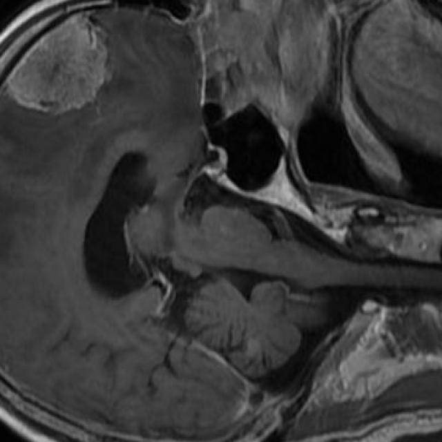
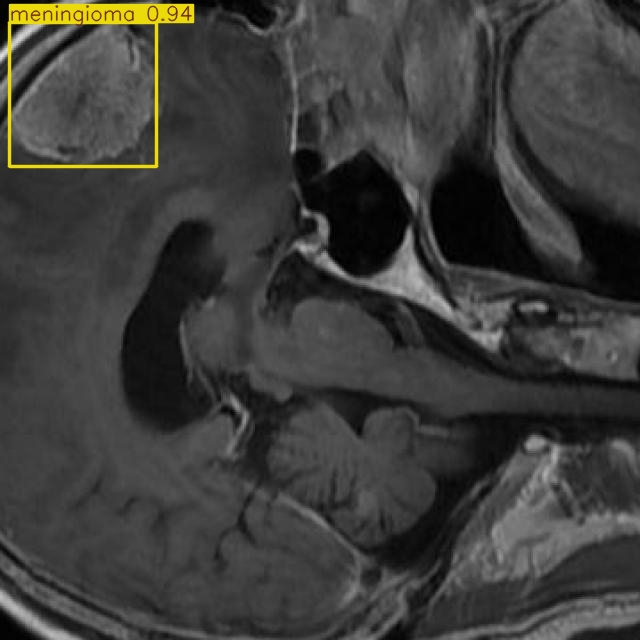
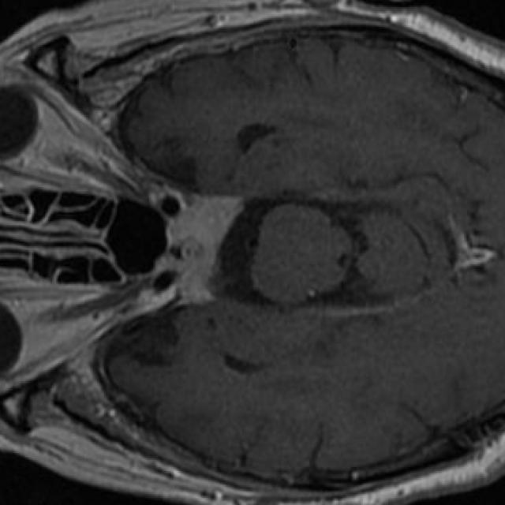
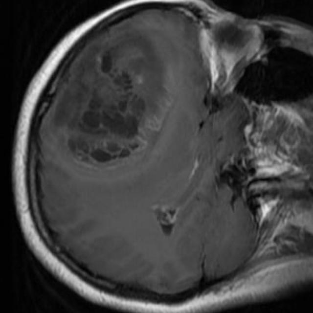
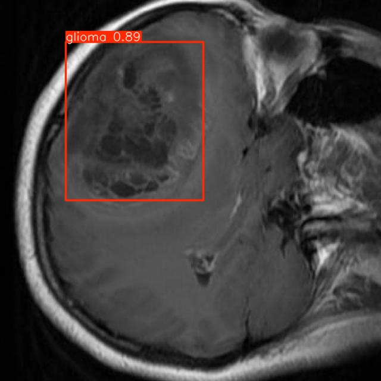

# 🧠 Brain Tumor Detection with YOLOv8

<div align="center">


**🚀 AI-powered brain tumor detection using YOLOv8, optimized for MacBook Air M2**

[🔬 View Demo](#-demo) • [📊 Performance](#-model-performance) • [🛠️ Installation](#-installation) • [📖 Documentation](#-usage)

</div>

---

## ✨ Project Overview

This project uses **YOLOv8 nano** to detect brain tumors in MRI scans, trained on a Brain Tumor Detection Dataset from Kaggle. The model identifies three tumor types—Glioma, Meningioma, and Pituitary—with high precision and speed, optimized for Apple M2 hardware using the MPS backend.

### 🎯 Key Achievements
- 🏆 **91.1% mAP50** on test dataset
- ⚡ **11.7ms** inference time per image
- 🎯 **Multi-class detection** for Glioma, Meningioma, and Pituitary tumors
- 🔬 **Efficient processing** with batch size 8 and 416x416 image size

### 🧬 Tumor Types Detected
| Tumor Type | Mean Average Precision (mAP50) |
|------------|-------------------------------|
| **🔴 Glioma** | 80.1% |
| **🟢 Meningioma** | 96.6% |
| **🔵 Pituitary** | 96.5% |

---

## 🎯 Features

<table>
<tr>
<td width="50%">

### 🤖 AI-Powered Detection
- **YOLOv8 Nano Architecture**: Lightweight and efficient
- **Transfer Learning**: Fine-tuned on Kaggle brain tumor dataset
- **Multi-class Recognition**: 3 tumor types
- **Bounding Box Localization**: Precise tumor identification

</td>
<td width="50%">

### ⚡ Performance Optimized
- **Fast Inference**: < 12ms per image
- **High Accuracy**: 91.1% mAP50
- **M2 Optimized**: Uses MPS backend
- **Low Memory**: Batch size 8, image size 416

</td>
</tr>
<tr>
<td width="50%">

### 📊 Comprehensive Analytics
- **Detailed Metrics**: Precision, Recall, mAP scores
- **Standard Visualizations**: Confusion matrix, PR curves
- **Training Logs**: Loss and metric progression
- **Output Storage**: Results saved in runs/

</td>
<td width="50%">

### 🔧 Developer Friendly
- **Easy Setup**: Jupyter notebook workflow
- **Standard YOLOv8 Scripts**: Train, validate, predict
- **Well Documented**: Notebook with comments
- **GitHub Integration**: Version control setup

</td>
</tr>
</table>

---

## 📊 Model Performance

<div align="center">

### 🏆 Overall Performance Metrics

| Metric | Value | Description |
|--------|-------|-------------|
| **mAP50** | **91.1%** | Mean Average Precision at IoU=0.5 |
| **mAP50-95** | **71.6%** | Mean Average Precision at IoU=0.5:0.95 |
| **Precision** | **84.6%** | Overall detection precision |
| **Recall** | **89.3%** | Overall detection recall |
| **Inference Speed** | **11.7ms** | Average time per image (preprocess: 0.6ms, inference: 5.0ms, postprocess: 6.1ms) |

</div>

### 🎯 Class-Specific Performance

```
📈 DETAILED BREAKDOWN
━━━━━━━━━━━━━━━━━━━━━━━━━━━━━━━━━━━━━━━━━━━━━━━━━━━

🔴 GLIOMA
   Precision: 74.1%  |  Recall: 77.4%  |  mAP50: 80.1%  |  mAP50-95: 55.6%

🟢 MENINGIOMA  
   Precision: 89.4%  |  Recall: 95.2%  |  mAP50: 96.6%  |  mAP50-95: 84.3%

🔵 PITUITARY
   Precision: 90.2%  |  Recall: 95.4%  |  mAP50: 96.5%  |  mAP50-95: 75.0%

━━━━━━━━━━━━━━━━━━━━━━━━━━━━━━━━━━━━━━━━━━━━━━━━━━━
```

> **💡 Performance Insights**: Meningioma and Pituitary tumors show high detection performance (>96% mAP50). Glioma detection (80.1% mAP50) could improve with more epochs or a larger model (e.g., YOLOv8s).

---

## 🚀 Quick Start

### 📋 Prerequisites

```bash
# System Requirements
Python 3.10
Apple M2 device with MPS support (or CPU fallback)
PyTorch with MPS support
8GB+ RAM recommended
```

### ⚡ One-Line Installation

```bash
# Clone and setup
git clone https://github.com/S-T-R-A-N-G-E-R/Brain_Tumor_Detection.git && cd Brain_Tumor_Detection && conda create -n NNDL python=3.10 && conda activate NNDL && pip install ultralytics
```

### 🔧 Manual Installation

```bash
# 1. Clone the repository
git clone https://github.com/S-T-R-A-N-G-E-R/Brain_Tumor_Detection.git
cd Brain_Tumor_Detection

# 2. Create and activate Anaconda environment
conda create -n NNDL python=3.10
conda activate NNDL

# 3. Install dependencies
pip install ultralytics torch

# 4. Download dataset
# Obtain Brain Tumor Detection Dataset from Kaggle and place in /path/to/BrainTumor/BrainTumorYolov8/
# Ensure data.yaml specifies train/valid/test splits and classes (glioma, meningioma, pituitary)
```

---

## 🎮 Usage

### 🏋️ Training Your Model

```bash
# Basic training (run in Jupyter notebook)
from ultralytics import YOLO
model = YOLO('yolov8n.pt')
model.train(data='/path/to/BrainTumor/BrainTumorYolov8/data.yaml', epochs=50, imgsz=416, batch=8, device='mps', iou=0.5, conf=0.25, max_det=100)
```

### 🔮 Running Inference

```bash
# Single image detection
python -c "from ultralytics import YOLO; model = YOLO('runs/detect/brain_tumor_train2/weights/best.pt'); model.predict(source='path/to/image.jpg', imgsz=416, conf=0.25)"

# Batch processing
python -c "from ultralytics import YOLO; model = YOLO('runs/detect/brain_tumor_train2/weights/best.pt'); model.predict(source='data/test/images/', imgsz=416, conf=0.25)"
```

### 📊 Model Evaluation

```bash
# Test set evaluation
python -c "from ultralytics import YOLO; model = YOLO('runs/detect/brain_tumor_train2/weights/best.pt'); model.val(data='/path/to/BrainTumor/BrainTumorYolov8/data.yaml', split='test', imgsz=416, device='mps', iou=0.5, conf=0.25, max_det=100)"
```

---

## 📁 Project Architecture

```
🧠 Brain_Tumor_Detection/
├── 📊 BrainTumor/BrainTumorYolov8/  # Dataset
│   └── ⚙️ data.yaml                 # Dataset configuration
├── 🏃 runs/                         # Training and inference outputs
│   ├── 🎯 brain_tumor_train2/       # Training logs and checkpoints
│   └── 🔍 detect/                   # Detection outputs
├── ⚖️ weights/                      # Model weights
│   ├── 🥇 best.pt                   # Best performing model
│   ├── 📝 last.pt                   # Latest checkpoint
│   └── 📝 best.onnx                 # Exported ONNX model
├── 🐍 training.ipynb                # Training notebook
├── 📋 .gitignore                    # Excludes large files
└── 📖 README.md                     # This file
```

---

## 🧪 Demo

### 🖼️ Sample Detections

<div align="center">

| Original MRI | Detection Result | Confidence |
|--------------|------------------|------------|
|  |  | **93.65%** Meningioma |
|  |  | **91.60%** Pituitary |
|  |  | **89.14%** Glioma |

</div>

### 📊 Performance Visualizations

- 📈 **Training Curves**: Loss and metric progression
- 🎯 **Confusion Matrix**: Class-wise prediction accuracy
- 📉 **PR Curves**: Precision-Recall relationships
- 📊 **Performance Charts**: Comparative analysis

---

## 🔬 Technical Details

### 🏗️ Model Architecture
- **Backbone**: YOLOv8 nano
- **Input Size**: 416x416 pixels
- **Classes**: 3 (Glioma, Meningioma, Pituitary)
- **Parameters**: 3,011,433 (8.2 GFLOPs)

### 🎛️ Training Configuration
- **Optimizer**: AdamW (auto-detected, lr=0.001429)
- **Learning Rate**: Initial=0.01, final=0.1x (cosine scheduling)
- **Data Augmentation**: Mosaic (disabled in last 10 epochs), hsv_h=0.015, hsv_s=0.7, hsv_v=0.4, fliplr=0.5, translate=0.1, scale=0.5
- **Loss Function**: YOLOv8 default (Classification + Objectness + Box regression)
- **Dataset**: 2144 train images, 612 validation images

### ⚡ Optimization Features
- **Mixed Precision**: Enabled (amp=True, MPS backend)
- **ONNX Export**: Supported for deployment
- **NMS Optimization**: IoU=0.5, Confidence=0.25, max_det=100 to reduce NMS load

---

## 🔄 Roadmap

### 🎯 Potential Improvements
- [ ] Increase epochs to 100 for better mAP
- [ ] Test YOLOv8s for improved accuracy (if memory allows)
- [ ] Experiment with additional data augmentation
- [ ] Explore YOLOv9/YOLOv11 models

---

## 🤝 Contributing

We welcome contributions! Here's how to help:

<details>
<summary>🛠️ <strong>How to Contribute</strong></summary>

### 🐛 Bug Reports
- Use GitHub Issues with detailed descriptions
- Include error logs and system information
- Provide steps to reproduce the issue

### ✨ Feature Requests
- Open an issue with the `enhancement` label
- Describe the feature and its benefits
- Include examples if applicable

### 🔀 Pull Requests
1. Fork the repository
2. Create a feature branch (`git checkout -b feature-name`)
3. Make your changes
4. Commit with descriptive messages
5. Push and create a Pull Request

### 📝 Documentation
- Improve notebook comments
- Add tutorials or guides

</details>

---

## 🙏 Acknowledgments

<div align="center">

**Thanks to:**

🏆 [**Ultralytics**](https://github.com/ultralytics/ultralytics) - For the YOLOv8 framework  
🧠 **Kaggle Dataset Contributors** - For providing brain tumor data  
💝 **Open Source Community** - For inspiration and support  

</div>

---

<div align="center">

### 🌟 Show Your Support

If this project helped you, please consider giving it a ⭐!


**Made with ❤️ for the medical AI community**

---

*"Advancing healthcare through artificial intelligence - one detection at a time."*

</div>